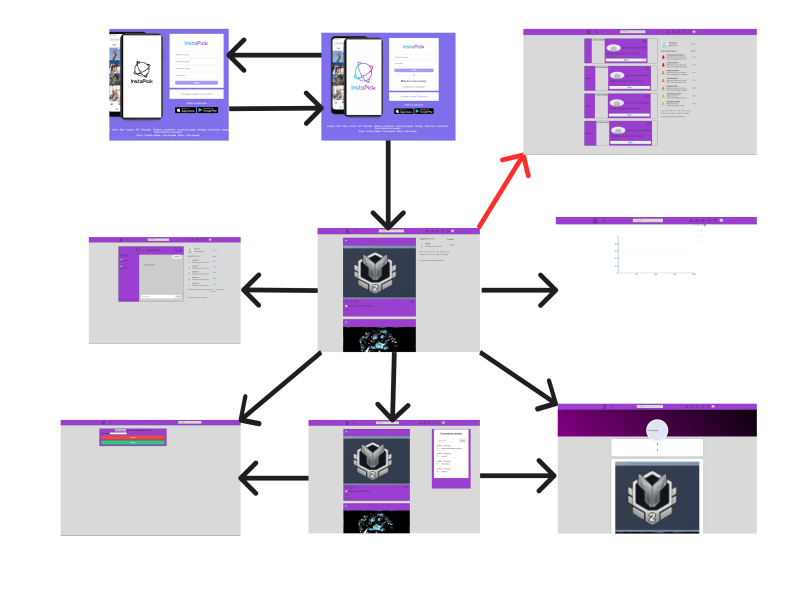

# webapp05
### InstaPick

## Integrantes
>| Nombre y Apellidos   | Correo universidad | Usuario GitHub |
>|----------------------|--------------------|----------------|
>| Younes Labchiri Boukhalef | y.labchiri.2021@alumnos.urjc.es | cherno1929     |
>| Jorge Luis Peñate Perdomo | jl.penate.2021@alumnos.urjc.es | jorge1380      |
>  | Ángel Murciano Baena | a.murciano.2021@alumnos.urjc.es | Angel-Murciano |
>  | Adrián Aguilar Rodríguez | a.aguilarr.2018@alumnos.urjc.es | adrianielestudiante |
> | Álvaro Sepúlveda Crespo | a.sepulvedac.2018@alumnos.urjc.es | alvaro-sepu |

## Enlaces
Trello: https://trello.com/b/xBmOw4l7/daw 

## Detalles de la aplicación
>### Entidades
> Usuario, Post, Chat, Comentario

> ### Permisos de los usuarios
> Usuario anónimo: Ver Posts y perfiles. \
> Usuario registrado: Gestionar posts propios, seguir usuarios, comentar y crear chats privados con otros usuarios. \
> Admin: Gestionar todos los posts, gestionar las cuentas y gestionar los comentarios.

>### Imágenes
> Posts, fotos de perfil y enviar en los chats.

>### Gráficos
> Se utilizaran para mostrar las estadísticas de los perfiles que podrá consultar el usuario.

>### Tecnología complementaria
> Cada usuario podrá generar un archivo pdf con las estadísticas de su perfil (informe).

>### Algoritmo o consulta avanzada
> Algoritmo para recomendar personas a los usuarios.

## Pantallas

### Pantalla login

### Pantalla registro

### Patalla inicial

### Pantalla perfil

### Pantalla chat

### Pantalla crear post

### Pantalla estadísticas

### Pantalla comentarios

### Pantalla admin

## Diagramas fase 2

### Diagrama base de datos

### Diagrama UML

### Diagrama relaciones

### Diagrama de navegación

## Instrucciones de ejecución
Se requerirá descargar el código del repositorio "https://github.com/CodeURJC-DAW-2023-24/webapp05.git", una vez se tenga el código se requerirá el uso de una base de datos MySQL, para ello se recomienda el uso de la herramienta "MySQL Workbench", la cual hay que configurarla para que actue como base de datos en vez de su modo rendimiento (para desarrolladores).
Una vez iniciada, sera necesario conectar la base al server por un archivo llamado "application.properties", cambiando los datos de "#MySQL" como con que eschema va a funcionar (spring.datasource.url), con que usuario (spring.datasource.username), y la contraseña (spring.datasource.password).

Y a estas alturas solo sera necesario correr la aplicación web.

Requisitos:

-Versión Maven : 4.0.0
-Versión SpringBoot : 3.2.2
-Versión Java : 17
-Versión MySQL : 8.0.19

Sera necesario tener instalados todos estos programas para que la aplicación corra de forma exitosa

# Participación de cada miembro
## Younes Labchiri Boukhalef

### Descripción textual de las tareas realizadas en la fase:
- Implementación de añadir post.
- Implementación de comentarios y chats.
- Implementación de la base de datos.
- Implementación de carga de los posts con Ajax.

### Listado de los 5 commits más significativos:
1. [Structuring for the server and database](https://github.com/CodeURJC-DAW-2023-24/webapp05/commit/431c2a4207fe3fc49bb7f1a97bd6d7229943e4a8#diff-c7963cf0b5d97341d74345d604393754470ae4354c7e33f451fa7de38aa3ec0c)
2. [Create new post is working](https://github.com/CodeURJC-DAW-2023-24/webapp05/commit/8fe0d2e9eb229f586b8ea746044e8cf147493e0e)
3. [Infinite scroll for posts added, but there are troubles getting an ex…](https://github.com/CodeURJC-DAW-2023-24/webapp05/commit/62cd591edccf9f268eb38a0cefb1d016c7728cca)
4. [Chats functionality + AddFriend in post + Add ChatComments : Working](https://github.com/CodeURJC-DAW-2023-24/webapp05/commit/3115f0c4bf54c2c2446d6e3b3721577c6470e9b4)
5. [Admin functionality added, but waiting for security_config to set just for admins](https://github.com/CodeURJC-DAW-2023-24/webapp05/commit/dfff449008a0aa9b447c8cf8f6e3dc47874b57f9)

### Listado de los 5 ficheros en los que más haya participado:
1. [PostRestController.java](src%2Fmain%2Fjava%2Fes%2Fcodeurjc%2FInstapick%2FrestController%2FPostRestController.java)
2. [MediaController.java](src%2Fmain%2Fjava%2Fes%2Fcodeurjc%2FInstapick%2Fcontroller%2FMediaController.java)
3. [NewPostController.java](src%2Fmain%2Fjava%2Fes%2Fcodeurjc%2FInstapick%2Fcontroller%2FNewPostController.java)
4. [post_app.js](src%2Fmain%2Fresources%2Fstatic%2Fjs%2Fpost_app.js)
5. [new_post.js](src%2Fmain%2Fresources%2Fstatic%2Fjs%2Fnew_post.js)

## Jorge Luis Peñate Perdomo

### Descripción textual de las tareas realizadas en la fase:
- Implementación de seguridad.
- Implementación de la página de los perfiles de los usuarios.
- Implementación del gráfico.
- Implementación del envío de email al registrarse

### Listado de los 5 commits más significativos:
1. [Sending email function when a user registers added](https://github.com/CodeURJC-DAW-2023-24/webapp05/commit/5e93faf60621c992a7e0232ea520b59f6cc5f94d)
2. [Security Configuration added](https://github.com/CodeURJC-DAW-2023-24/webapp05/commit/c3b0eefe3d6c5b2564247a8941d3d9f733cc0278)
3. [CSRF configuration added and anonym user navigation added](https://github.com/CodeURJC-DAW-2023-24/webapp05/commit/6ea7d7426c4a942831d7d8f423f9afffeb2a93b3)
4. [Most liked post graphic added](https://github.com/CodeURJC-DAW-2023-24/webapp05/commit/4c8619f6a51e6cfe5d01b6d0a88f77d0497e6420)
5. [Added login function](https://github.com/CodeURJC-DAW-2023-24/webapp05/commit/934f252051a9ec94d249448dba1ac8d3e2db27cc)

### Listado de los 5 ficheros en los que más haya participado:
1. [SecurityConfig.java](src%2Fmain%2Fjava%2Fes%2Fcodeurjc%2FInstapick%2Fsecurity%2FSecurityConfig.java)
2. [EmailServiceImpl.java](src%2Fmain%2Fjava%2Fes%2Fcodeurjc%2FInstapick%2Fservice%2FEmailServiceImpl.java)
3. [DataBaseUserLoader.java](src%2Fmain%2Fjava%2Fes%2Fcodeurjc%2FInstapick%2Fsecurity%2FDataBaseUserLoader.java)
4. [CSRFHandlerConfiguration.java](src%2Fmain%2Fjava%2Fes%2Fcodeurjc%2FInstapick%2Fsecurity%2FCSRFHandlerConfiguration.java)
5. [PostRestController.java](src%2Fmain%2Fjava%2Fes%2Fcodeurjc%2FInstapick%2FrestController%2FPostRestController.java)

## Ángel Murciano Baena

### Descripción textual de las tareas realizadas en la fase:
- Arreglo de imagenes a la hora de crear un nuevo post.
- Arreglo puntual de iconos del header.
- Colaboración en la implementación de la paginación de posts.

### Listado de los 5 commits más significativos:
1. [Adding a new post now loads pictures properly](https://github.com/CodeURJC-DAW-2023-24/webapp05/commit/3550ad90af81fddeeb37931b1a10cbb76b24bd51)
2. [New Post button changes according to page theme](https://github.com/CodeURJC-DAW-2023-24/webapp05/commit/12bd57911b60f99246d56d56a75704722477a6aa)
3. [Creation of search query functions](https://github.com/CodeURJC-DAW-2023-24/webapp05/commit/db27733b3ab879e3b777a69112230d5bcc44dfcf)
4. [Addition of unpaginated and paginated queries](https://github.com/CodeURJC-DAW-2023-24/webapp05/commit/01f0e92c47f3403b26df32376d614bae6cdf1aa0)
5. [Pagination of Post page](https://github.com/CodeURJC-DAW-2023-24/webapp05/commit/751cb47ae2e666a266c107e52cb3ff29c52d284f)
### Listado de los 5 ficheros en los que más haya participado:
1. [PostRepository.java](src%2Fmain%2Fjava%2Fes%2Fcodeurjc%2FInstapick%2Frepository%2FPostRepository.java)
2. [PostService.java](src%2Fmain%2Fjava%2Fes%2Fcodeurjc%2FInstapick%2Fservice%2FPostService.java)
3. [PostCommentRepository.java](src%2Fmain%2Fjava%2Fes%2Fcodeurjc%2FInstapick%2Frepository%2FPostCommentRepository.java)
4. [User.java](src%2Fmain%2Fjava%2Fes%2Fcodeurjc%2FInstapick%2Fmodel%2FUser.java)
5. [PostController.java](src%2Fmain%2Fjava%2Fes%2Fcodeurjc%2FInstapick%2Fcontroller%2FPostController.java)

